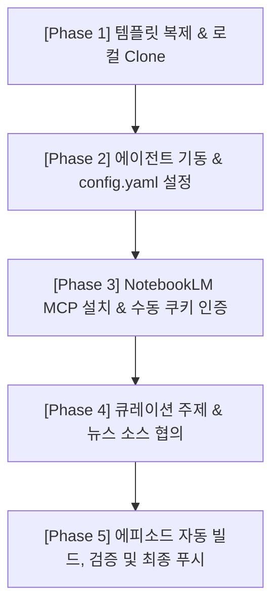

# 🎙️ AI Podcast Auto-Publisher Template

이 저장소는 자율 AI 에이전트(Hermes, Goose 등)가 매일 새로운 뉴스 콘텐츠를 수집하고 요약한 후, **NotebookLM의 딥 리서치(Deep Research) 및 오디오 오버뷰(Audio Overview) 기능**을 활용해 완성도 높은 대화형 오디오 콘텐츠를 생성하여 팟캐스트 피드(`feed.xml`)로 **완전 자동으로 빌드 및 배포**할 수 있도록 설계된 통합 템플릿입니다.

---

## 🌟 핵심 특징

- **100% 완전 자동 GitHub Pages 호스팅**: 
  Actions가 빌드 결과를 배포용 브랜치(`gh-pages`)로 자동 푸시하며, 유저가 설정창에 들어갈 필요 없이 Pages 서비스가 자동으로 개시 및 퍼블리싱됩니다.
- **Git URL 자동 추론**: 
  설정 파일에 도메인을 적지 않아도 로컬 `.git` 정보를 분석하여 `https://<username>.github.io/<repository-name>/` 주소를 알아서 만들어 피드에 연동합니다.
- **철저한 사전 정합성 검증 (`validate_feed.py`)**: 
  배포 전에 Apple Podcasts/iTunes 규격을 자동 체크하여 깨진 XML 파일이 업로드되는 현상을 원천 방지합니다.

---

## 🚀 빠른 시작 가이드 (Quick Start)

### 1단계: 템플릿 저장소 생성
1. 이 저장소 상단의 **`Use this template`** 버튼을 클릭하여 본인의 GitHub 계정으로 새 저장소를 생성합니다.

### 2단계: 팟캐스트 메타데이터 설정
- 저장소 루트에 위치한 `config.yaml` 파일을 열어 내 팟캐스트 정보에 맞게 수정합니다.
  ```yaml
  title: "나의 인공지능 일일 뉴스"
  description: "AI 에이전트가 매일 알려주는 스마트한 AI 테크 뉴스"
  language: "ko-KR"
  author: "홍길동"
  owner:
    name: "홍길동"
    email: "gildong@example.com"
  category: "Technology"
  base_url: "" # 💡 비워두면 저장소 주소에 맞춰 자동으로 채워집니다!

### 3단계: 🔗 팟캐스트 청취 및 배포 링크 안내
본 템플릿으로 저장소를 배포하면, 팟캐스트 앱 등록 및 청취용 링크는 다음과 같이 구성됩니다:
- **구독용 RSS 피드 URL** (Apple Podcasts, Spotify 등 플랫폼 등록용):
  `https://<본인_GitHub_아이디>.github.io/<저장소_이름>/feed.xml`
- **에피소드 개별 음성 파일 재생 URL**:
  `https://<본인_GitHub_아이디>.github.io/<저장소_이름>/audio/<음성_파일명>`
- **팟캐스트 커버 이미지 URL**:
  `https://<본인_GitHub_아이디>.github.io/<저장소_이름>/cover.png`

*(예: 내 아이디가 `gildong`이고 저장소 이름이 `my-podcast`라면, RSS 주소는 `https://gildong.github.io/my-podcast/feed.xml`이 됩니다.)**(예: 내 아이디가 `gildong`이고 저장소 이름이 `my-podcast`라면, RSS 주소는 `https://gildong.github.io/my-podcast/feed.xml`이 됩니다.)*

---

## 🚀 에이전트 협업 & 팟캐스트 구축 워크플로우

템플릿 복제부터 첫 에피소드 발행까지, **유저와 자율 에이전트가 어떻게 티키타카(상호작용)하며 팟캐스트를 구축하는지** 단계별 마일스톤 가이드입니다. 

에이전트에게 작업을 요청할 때 아래 순서대로 파이프라인을 따라가면 가장 견고하게 구축할 수 있습니다.



### 📍 [Phase 1] 템플릿 복제 및 로컬 저장
1. 이 템플릿을 `Use this template`로 복제하고 본인의 로컬 PC나 서버에 `git clone`하여 다운로드합니다.

### 📍 [Phase 2] 에이전트 첫 기동 및 config.yaml 설정
1. 로컬 환경에서 코딩 에이전트(Hermes 등)를 엽니다.
2. **에이전트에게 첫 명령을 전달합니다**:
   > "현재 저장소 구조를 파악해 줘. 그리고 내 팟캐스트 정보를 담을 수 있도록 `config.yaml` 설정을 나와 대화하며 채워줘."
3. 에이전트가 질문을 던지면 팟캐스트 이름, 저자 이메일 등을 대답하여 `config.yaml` 작성을 완료합니다.

### 📍 [Phase 3] NotebookLM-mcp-cli 세팅 및 유저 인증 (Authorization)
1. **에이전트에게 도구 세팅을 명령합니다**:
   > "팟캐스트 음성 생성을 위해 로컬 환경에 `notebooklm-mcp-cli`를 설치 및 연동해주고, 구글 계정 로그인(쿠키 인증) 방법을 나에게 안내해줘."
2. **에이전트의 액션**:
   - 에이전트가 로컬 터미널에서 `pip install notebooklm-mcp-cli`를 설치합니다.
   - NotebookLM은 웹 보안상 자동 로그인이 지원되지 않으므로, 에이전트가 유저에게 **"구글 크롬 개발자 도구(F12)에서 NotebookLM 쿠키(`NLM_COOKIES`)를 추출하여 제공해 주세요"**라고 자세한 추출 가이드를 띄워 알려줍니다.
3. **유저의 피드백**:
   - 유저가 브라우저에서 쿠키를 추출해 `.env` 파일에 `NLM_COOKIES="..."` 형태로 적거나 에이전트에게 제공합니다.
   - 에이전트는 제공받은 쿠키 파일을 로드하여 `nlm login --manual --file ...`를 로컬에 성공적으로 기동하여 초기 인증을 마칩니다.

### 📍 [Phase 4] 큐레이션 주제 선정 및 소스 생성
1. **에이전트가 유저에게 큐레이션 뉴스를 탐색하기 위해 협의를 요청합니다**:
   > "오늘 팟캐스트에서 다룰 AI 핵심 주제나 특별히 큐레이션하고 싶으신 뉴스 사이트/RSS/키워드가 있으신가요?"
2. **유저의 피드백**:
   - 예: "매일 아침 Hacker News와 TechCrunch에서 'AI Agent' 및 'LLM'과 관련된 가장 핫한 뉴스 5개를 긁어다 팟캐스트로 만들어줘."
3. **에이전트의 액션**:
   - 에이전트가 해당 뉴스 소스들을 서칭하고, 청취자 중심의 요약 대본(Markdown)을 집필하여 유저에게 먼저 프리뷰로 보고합니다.

### 📍 [Phase 5] 팟캐스트 에피소드 자동 빌드 및 배포
1. 유저가 대본에 만족하면, 에이전트가 NotebookLM CLI 명령어나 TTS API를 호출해 `audio/` 폴더에 오디오 음성 파일(`AI_Daily_News_YYYY-MM-DD.mp3`)을 생성합니다.
2. 에이전트가 `python scripts/update_feed.py`를 실행해 피드에 밀어넣습니다.
3. 에이전트가 `python scripts/validate_feed.py`를 실행하여 iTunes 팟캐스트 규격을 철저하게 검증합니다.
4. 검증 완료 후 에이전트가 Git main 브랜치에 자동으로 커밋/푸시합니다.
5. GitHub Actions가 작동하여 GitHub Pages에 정적 에셋이 배포됩니다.
6. **최종 보고**: 에이전트가 배포 성공 주소(예: `https://mommocmoc.github.io/my-ai-podcast-template/feed.xml`)를 담아 유저에게 즉시 들을 수 있게 보고하며 워크플로우가 마무리됩니다.

---

### 4단계: 로컬 실행 환경 준비 (개발자 & 에이전트용)
- 파이썬 의존성을 설치합니다:
  ```bash
  pip install -r requirements.txt
  ```

---

## 🛠️ 핵심 도구 사용법

### 1. 에피소드 피드 업데이트 (`update_feed.py`)
새로 생성한 음성 파일(`audio/AI_Daily_News_2026-06-01.mp3` 등)이 준비되었을 때 피드에 주입하는 스크립트입니다:
```bash
python scripts/update_feed.py "에피소드 제목" "음성_파일명.mp3" "에피소드 요약 정보"
```

### 2. 피드 정합성 유효성 검사 (`validate_feed.py`)
배포하기 전 피드가 XML 문법을 잘 지켰는지, 필수 iTunes 태그가 살아있는지 검증합니다:
```bash
python scripts/validate_feed.py
```
*(성공 시 Exit code 0, 문제 있을 시 실패 원인 로깅 후 Exit code 1 반환)*

---

## 🤖 에이전트(Hermes 등)에게 운영 위임하기

이 저장소를 에이전트가 스스로 제어하도록 하려면, 에이전트에게 아래 프롬프트를 입력하세요:

> "현재 저장소 구조와 `AGENT.md` 운영 정책을 분석해줘. 매일 아침 8시에 AI 뉴스를 수집하고 음성을 합성한 뒤, `python scripts/update_feed.py`와 `validate_feed.py`를 거쳐 `feed.xml` 무결성 검증을 마친 후 메인 브랜치에 안전하게 자동 커밋/푸시하는 크론 잡(또는 자동 루프)을 생성하고 기동해줘."

---

## 🔒 GitHub 권한 설정 유의 사항
본 저장소의 GitHub Actions는 배포 및 검증을 자동으로 수행합니다. 워크플로우 작동을 보장하기 위해 최초에 다음 설정을 점검해 주세요:
1. 저장소 상단의 `Settings` -> `Actions` -> `General`로 이동합니다.
2. 최하단 **`Workflow permissions`** 항목에서 **`Read and write permissions`**가 체크되어 있는지 확인하고 저장합니다. (Actions가 `gh-pages` 브랜치를 안전하게 생성/관리하기 위해 필수적입니다.)
